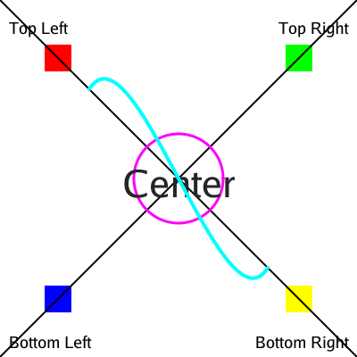

# Go-Cairo

A pure Go implementation of the Cairo 2D graphics library, fully compatible with the original Cairo C++ library API and behavior.

## Features

This implementation provides a complete port of Cairo's functionality to Go, including:

- **2D Vector Graphics**: Full support for vector graphics operations
- **Multiple Surface Types**: Image surfaces, PDF, SVG, and more
- **Pattern System**: Solid colors, gradients, and image patterns  
- **Path Operations**: Lines, curves, rectangles, arcs, and complex paths
- **Text Rendering**: Font selection and text drawing capabilities
- **Transformations**: Matrix operations and coordinate transformations
- **Clipping**: Path-based clipping regions

## Installation

```bash
go get github.com/novvoo/go-cairo
```

## Quick Start

```go
package main

import (
    "github.com/novvoo/go-cairo/pkg/cairo"
    "math"
)

func main() {
    // Create an image surface
    surface := cairo.NewImageSurface(cairo.FormatARGB32, 200, 200)
    defer surface.Destroy()
    
    // Create a context for drawing
    ctx := cairo.NewContext(surface)
    defer ctx.Destroy()
    
    // Set source color to red
    ctx.SetSourceRGB(1.0, 0.0, 0.0)
    
    // Draw a filled circle
    ctx.Arc(100, 100, 50, 0, 2*math.Pi)
    ctx.Fill()
    
    // Save to PNG
    surface.WriteToPNG("circle.png")
}
```

## API Compatibility

This library maintains API compatibility with the original Cairo library. Function names and parameters follow the same patterns, adapted for Go conventions:

- C function `cairo_move_to(cr, x, y)` becomes `ctx.MoveTo(x, y)`
- C function `cairo_set_source_rgb(cr, r, g, b)` becomes `ctx.SetSourceRGB(r, g, b)`
- Enums like `CAIRO_FORMAT_ARGB32` become constants like `cairo.FormatARGB32`

## Architecture

The library is organized into several packages:

- `pkg/cairo`: Main public API
- `internal/surface`: Surface implementations
- `internal/pattern`: Pattern implementations  
- `internal/path`: Path operations
- `internal/font`: Font and text handling
- `internal/image`: Image format support

## 测试示例

`test` 目录包含了多个示例程序，展示了 go-cairo 的各种功能：

### 综合功能测试

**comprehensive.go** - 完整的功能演示，包括：
- 基础图形绘制（矩形、圆形、线条）
- 文本渲染和对齐
- 贝塞尔曲线
- 坐标变换


运行方式：
```bash
cd test
go run comprehensive.go
```

### 圆形绘制对比

**circle_comparison.go** - 对比 `Arc` 和 `DrawCircle` 两种绘制圆形的方法


### PangoCairo 文本渲染

**pangocairo.go** - 展示 PangoCairo 文本渲染功能：
- 字体加载和配置
- 文本度量和定位
- 字形分析


### 文本边界框分析

**mi_with_bounds.go** - 可视化文本边界框和字符间距


### 字形分析工具

**glyph_analysis.go** - 字形渲染和碰撞检测分析


**glyph_outline_debug.go** - 字形轮廓调试工具，输出字形的详细信息

### 与 gg 库对比

**comprehensive-gg.go** - 使用 fogleman/gg 库实现相同效果，用于对比验证



## License

This project is dual-licensed under LGPL 2.1 and MPL 1.1, same as the original Cairo library.
