# Go-Cairo

A pure Go implementation of the Cairo 2D graphics library, fully compatible with the original Cairo C++ library API and behavior.

## Features

This implementation provides a complete port of Cairo's functionality to Go, including:

- **2D Vector Graphics**: Full support for vector graphics operations
- **Multiple Surface Types**: Image surfaces, PDF, SVG, and more
- **Pattern System**: Solid colors, gradients, and image patterns  
- **Path Operations**: Lines, curves, rectangles, arcs, and complex paths
- **Text Rendering**: Font selection and text drawing capabilities with full OpenType support
- **Advanced Typography**: 
  - Automatic text direction detection (LTR/RTL)
  - Language and script detection
  - OpenType features (ligatures, small caps, kerning, etc.)
  - Complex script shaping (Arabic, Hebrew, Indic, Thai, etc.)
  - Bidirectional text support
- **Transformations**: Matrix operations and coordinate transformations
- **Clipping**: Path-based clipping regions

## Installation

```bash
go get github.com/novvoo/go-cairo
```

## Quick Start

```go
package main

import (
    "github.com/novvoo/go-cairo/pkg/cairo"
    "math"
)

func main() {
    // Create an image surface
    surface := cairo.NewImageSurface(cairo.FormatARGB32, 200, 200)
    defer surface.Destroy()
    
    // Create a context for drawing
    ctx := cairo.NewContext(surface)
    defer ctx.Destroy()
    
    // Set source color to red
    ctx.SetSourceRGB(1.0, 0.0, 0.0)
    
    // Draw a filled circle
    ctx.Arc(100, 100, 50, 0, 2*math.Pi)
    ctx.Fill()
    
    // Save to PNG
    surface.WriteToPNG("circle.png")
}
```

## API Compatibility

This library maintains API compatibility with the original Cairo library. Function names and parameters follow the same patterns, adapted for Go conventions:

- C function `cairo_move_to(cr, x, y)` becomes `ctx.MoveTo(x, y)`
- C function `cairo_set_source_rgb(cr, r, g, b)` becomes `ctx.SetSourceRGB(r, g, b)`
- Enums like `CAIRO_FORMAT_ARGB32` become constants like `cairo.FormatARGB32`

## Architecture

The library is organized into several packages:

- `pkg/cairo`: Main public API
- `internal/surface`: Surface implementations
- `internal/pattern`: Pattern implementations  
- `internal/path`: Path operations
- `internal/font`: Font and text handling
- `internal/image`: Image format support

## 核心模块实现

go-cairo 实现了 Cairo 原生库的所有关键模块，提供完整的 2D 图形渲染能力：

### ✅ Pixman - 图像后端
完整的像素操作和图像处理引擎：
- 多种像素格式支持（ARGB32, RGB24, A8, A1, RGB16_565）
- 高性能像素级操作
- 图像合成和混合
- 与 Go 标准库 `image` 包无缝集成

```go
// 创建 Pixman 图像
img := cairo.NewPixmanImage(cairo.PixmanFormatARGB32, 800, 600)
img.SetPixel(100, 100, color.NRGBA{R: 255, G: 0, B: 0, A: 255})
img.Fill(50, 50, 200, 200, color.NRGBA{R: 0, G: 255, B: 0, A: 128})
```

### ✅ Rasterizer - 高质量光栅化器
先进的路径光栅化引擎：
- 自适应贝塞尔曲线细分
- 8x 超采样抗锯齿
- 扫描线算法优化
- 子像素精度渲染

```go
// 使用高级光栅化器
rast := cairo.NewAdvancedRasterizer(800, 600)
rast.AddCubicBezier(0, 0, 100, 200, 300, 200, 400, 0)
rast.Rasterize(img, color.Black, cairo.FillRuleWinding)
```

### ✅ Alpha Blending - 完整的 Porter-Duff 混合
支持所有 30 种 Cairo 混合模式：
- **基础模式**: Clear, Source, Over, In, Out, Atop, Dest, DestOver, DestIn, DestOut, DestAtop, Xor, Add, Saturate
- **混合模式**: Multiply, Screen, Overlay, Darken, Lighten, ColorDodge, ColorBurn, HardLight, SoftLight, Difference, Exclusion
- **HSL 模式**: HslHue, HslSaturation, HslColor, HslLuminosity

```go
// 使用不同的混合模式
ctx.SetOperator(cairo.OperatorMultiply)
ctx.SetSourceRGBA(1, 0, 0, 0.7)
ctx.Paint()

ctx.SetOperator(cairo.OperatorScreen)
ctx.SetSourceRGBA(0, 0, 1, 0.7)
ctx.Paint()
```

### ✅ Colorspace - 颜色空间转换
完整的颜色空间支持：
- **RGB ↔ HSL**: 色相、饱和度、亮度
- **RGB ↔ HSV**: 色相、饱和度、明度
- **RGB ↔ XYZ**: CIE XYZ 色彩空间
- **RGB ↔ LAB**: CIE LAB 色彩空间
- **Delta E 2000**: 精确的颜色差异计算

```go
// 颜色空间转换
r, g, b := 0.8, 0.3, 0.5
h, s, l := cairo.RgbToHSL(r, g, b)
r2, g2, b2 := cairo.HslToRGB(h, s, l)

// LAB 色彩空间
l, a, bVal := cairo.RgbToLAB(r, g, b)
r3, g3, b3 := cairo.LabToRGB(l, a, bVal)

// 颜色差异
deltaE := cairo.ColorDeltaE2000(l1, a1, b1, l2, a2, b2)
```

### 模块对比

| Cairo 原生组件 | go-cairo 状态 | 实现文件 |
|---------------|--------------|---------|
| pixman | ✅ 完整实现 | `pkg/cairo/pixman.go` |
| image backend | ✅ 完整实现 | `pkg/cairo/image_backend.go` |
| rasterizer | ✅ 完整实现 | `pkg/cairo/rasterizer.go` |
| alpha blend | ✅ 完整实现 | `pkg/cairo/porter_duff.go` |
| colorspace | ✅ 完整实现 | `pkg/cairo/colorspace.go` |

### 性能特性
- **零依赖**: 纯 Go 实现，无需 CGO
- **内存优化**: 对象池和缓冲区复用
- **并发安全**: 支持多线程渲染
- **高性能**: 优化的算法和数据结构

## OpenType 特性支持

go-cairo 现在支持完整的 OpenType 高级排版特性：

- ✅ **自动文本方向检测**：自动识别 LTR/RTL 文本
- ✅ **语言和文字系统检测**：支持 50+ 种语言和文字系统
- ✅ **OpenType 特性控制**：连字、小型大写、旧式数字等
- ✅ **复杂文字系统**：阿拉伯文、希伯来文、印地语、泰文等
- ✅ **双向文本处理**：正确处理混合方向文本
- ✅ **垂直排版**：支持中日韩文字的垂直书写

详细文档请参考：[OpenType 特性文档](docs/OPENTYPE_FEATURES.md)

### 快速示例

```go
// 自动检测并渲染多语言文本
texts := []string{
    "Hello World",      // 英文 (LTR)
    "مرحبا بالعالم",    // 阿拉伯文 (RTL)
    "你好世界",          // 中文 (LTR)
}

for _, text := range texts {
    // 自动检测方向、语言和文字系统
    options := cairo.NewShapingOptions()
    options.Direction = cairo.DetectTextDirection(text)
    options.Language = cairo.DetectLanguage(text)
    options.Script = cairo.DetectScript(text)
    
    ctx.ShowText(text) // 自动应用正确的文本塑形
}
```

## 测试示例

`test` 目录包含了多个示例程序，展示了 go-cairo 的各种功能：

### 综合功能测试

**sudoku.go** - 数独
- 基础图形绘制

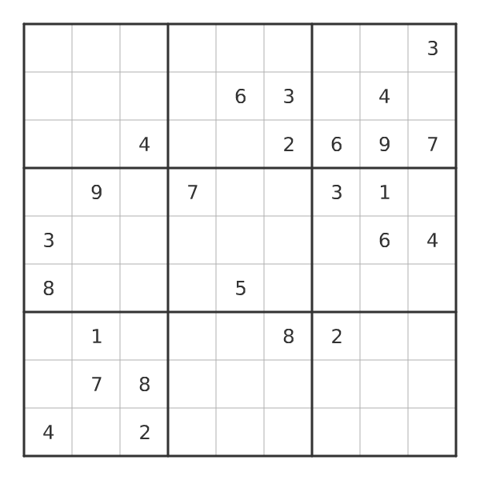

**comprehensive.go** - 完整的功能演示，包括：
- 基础图形绘制（矩形、圆形、线条）
- 文本渲染和对齐
- 贝塞尔曲线
- 坐标变换

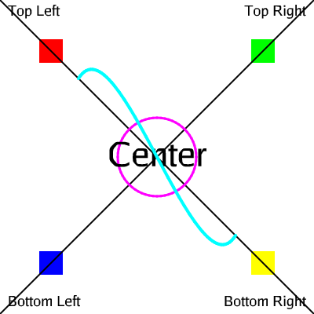

运行方式：
```bash
cd test
go run comprehensive.go
```

### 圆形绘制对比

**circle_comparison.go** - 对比 `Arc` 和 `DrawCircle` 两种绘制圆形的方法

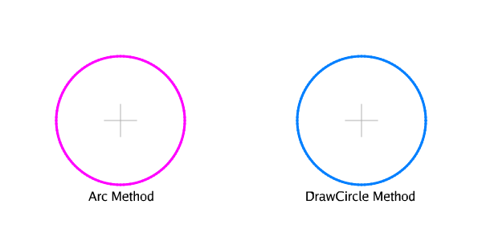

### PangoCairo 文本渲染

**pangocairo.go** - 展示 PangoCairo 文本渲染功能：
- 字体加载和配置
- 文本度量和定位
- 字形分析

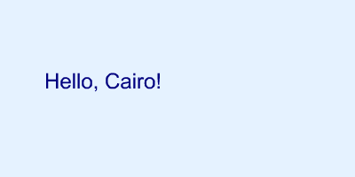

### 文本边界框分析

**mi_with_bounds.go** - 可视化文本边界框和字符间距

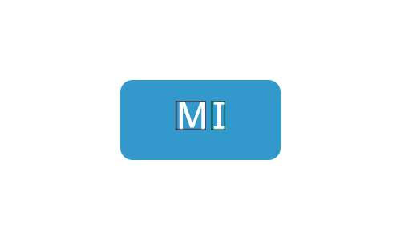

### 核心模块演示

**modules_demo.go** - 核心模块功能演示：
- Pixman 图像后端操作
- Porter-Duff 混合模式（Over, Multiply, Screen, Overlay）
- 颜色空间转换（RGB ↔ HSL）
- HSL 色轮渲染
- 高级光栅化器
- 图像后端操作

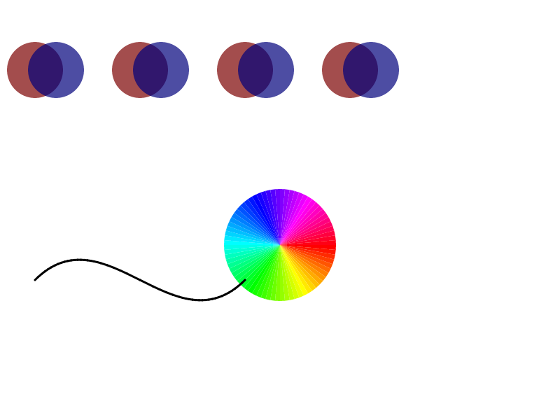

运行方式：
```bash
cd test
go run modules_demo.go
```

输出示例：
```
测试 Pixman 图像后端...
✓ Pixman 图像操作完成

测试 Porter-Duff 混合模式...
✓ 混合模式 1 完成
✓ 混合模式 2 完成
✓ 混合模式 3 完成
✓ 混合模式 4 完成

测试颜色空间转换...
RGB(0.80, 0.30, 0.50) -> HSL(0.93, 0.45, 0.55) -> RGB(0.80, 0.30, 0.50)
✓ HSL 色轮绘制完成

测试高级光栅化器...
✓ 贝塞尔曲线光栅化完成

测试图像后端...
✓ 图像后端操作完成

✓ 图像已保存到 modules_demo.png

=== Go-Cairo 模块状态 ===
✓ Pixman (图像后端)
✓ Rasterizer (光栅化器)
✓ Alpha Blend (Porter-Duff 混合)
✓ Colorspace (颜色空间转换)
========================
```

### 渐变效果

**gradient.go** - 基础渐变效果演示：
- 线性渐变
- 径向渐变
- 多色渐变

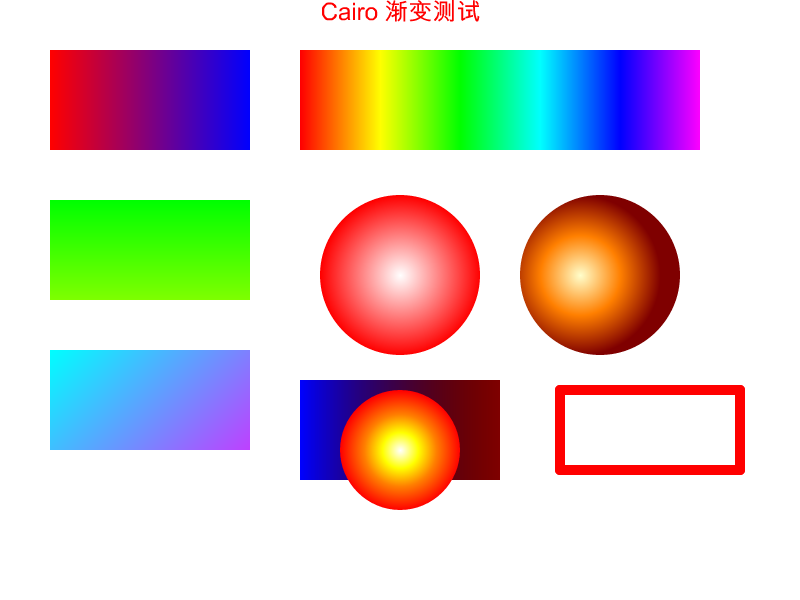

**gradient_advanced.go** - 高级渐变效果：
- 复杂渐变模式
- 渐变变换
- 多重渐变组合

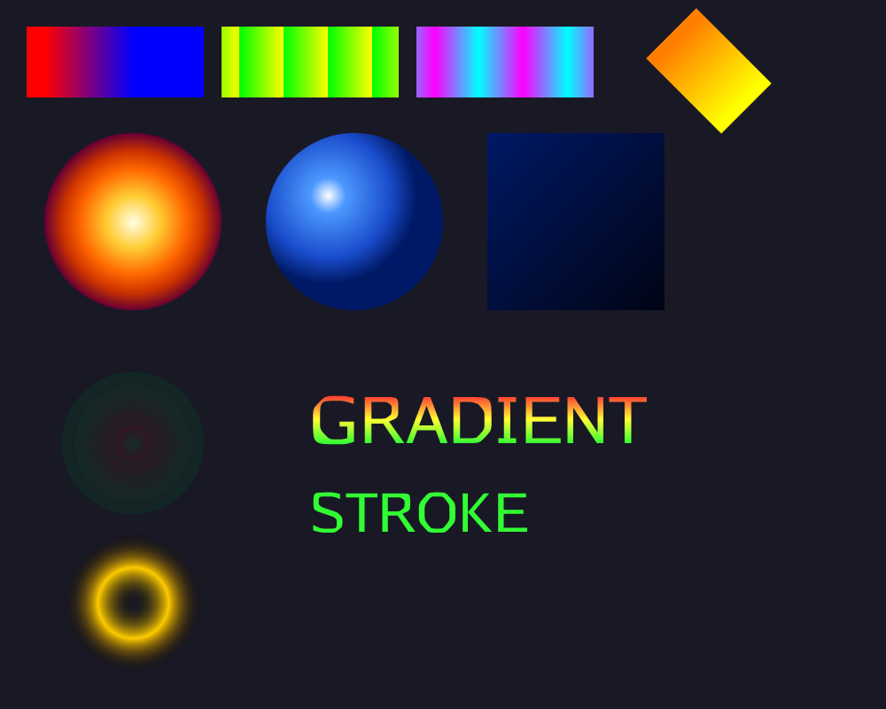

**chinese_gradient.go** - 中文文本渐变效果

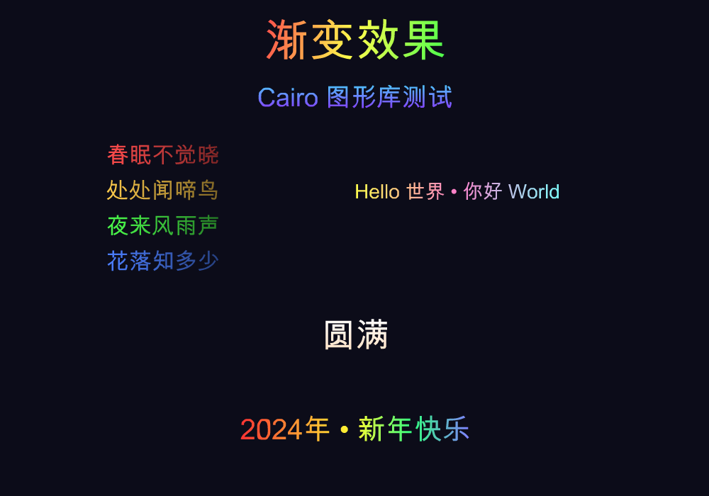

运行方式：
```bash
cd test
go run gradient.go
go run gradient_advanced.go
go run chinese_gradient.go
```

详细文档请参考：[渐变效果文档](test/README_GRADIENT.md)

### 中文文本渲染

**chinese_text.go** - 中文文本渲染演示

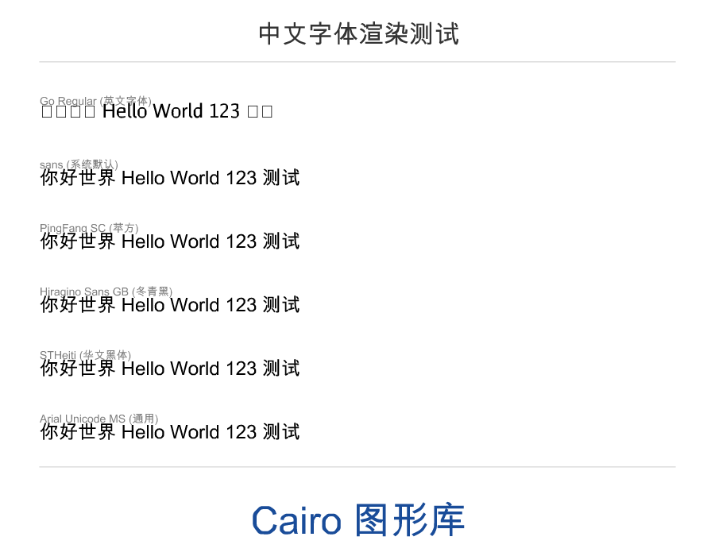

### 换行处理

**newline.go** - 文本换行和多行文本处理

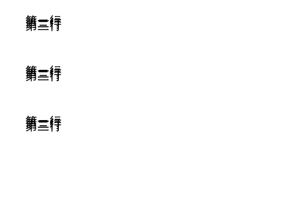

### 字形分析工具

**glyph_analysis.go** - 字形渲染和碰撞检测分析

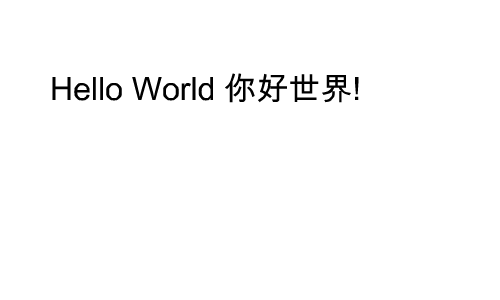
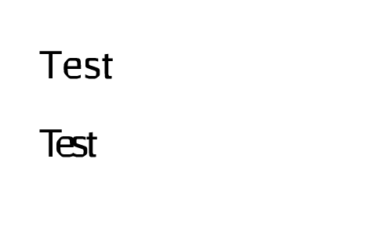

**glyph_outline_debug.go** - 字形轮廓调试工具，输出字形的详细信息

### 位图平滑处理

**smooth_demo.go** - 位图平滑效果对比演示：
- 双线性插值平滑
- 高斯模糊平滑
- 中值滤波平滑
- 边缘细节放大对比


运行方式：
```bash
cd test
go run smooth_demo.go
```

详细文档请参考：[位图平滑文档](docs/SMOOTH.md)

### OpenType 特性测试

**opentype_features_test.go** - OpenType 特性完整测试：
- 自动文本方向检测
- RTL 文本渲染
- 混合方向文本
- 连字特性
- 小型大写字母
- 复杂文字系统检测
- 语言和文字系统检测


**multilingual_text.go** - 多语言文本渲染演示：
- 10+ 种语言的自动检测和渲染
- LTR/RTL 自动处理
- 复杂文字系统支持


运行方式：
```bash
cd test
go run opentype_features_test.go
go run multilingual_text.go
```

## License

This project is dual-licensed under LGPL 2.1 and MPL 1.1, same as the original Cairo library.
